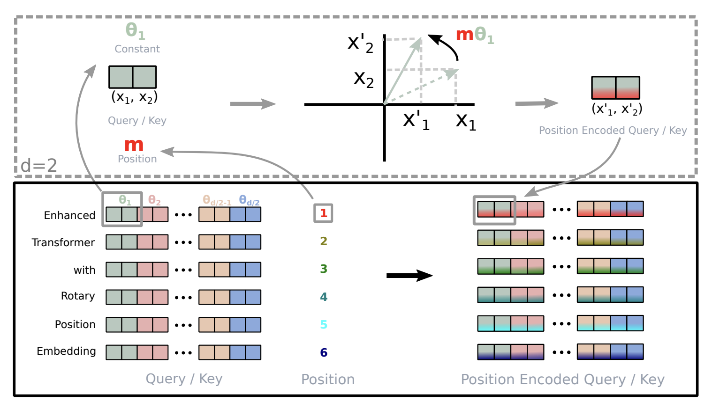
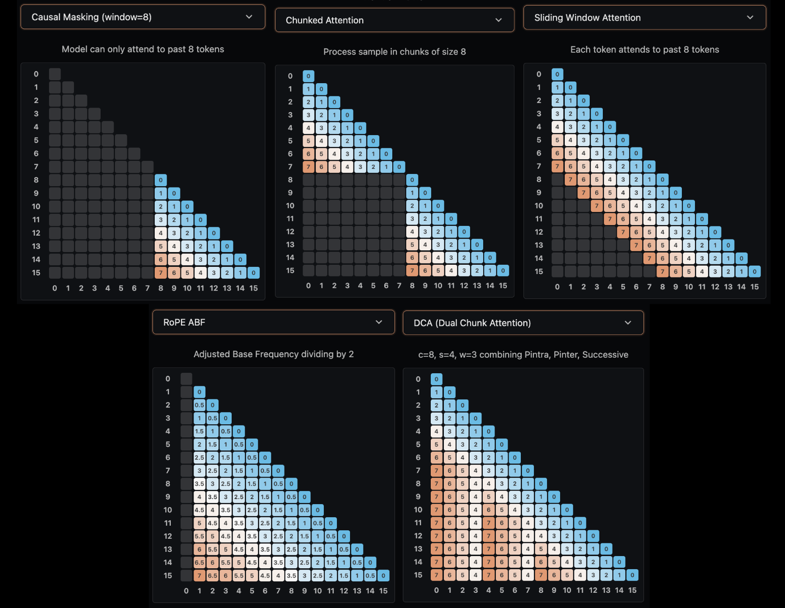
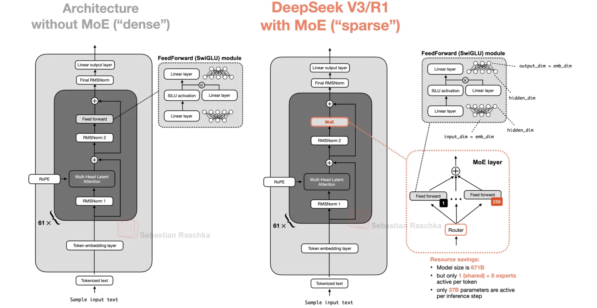
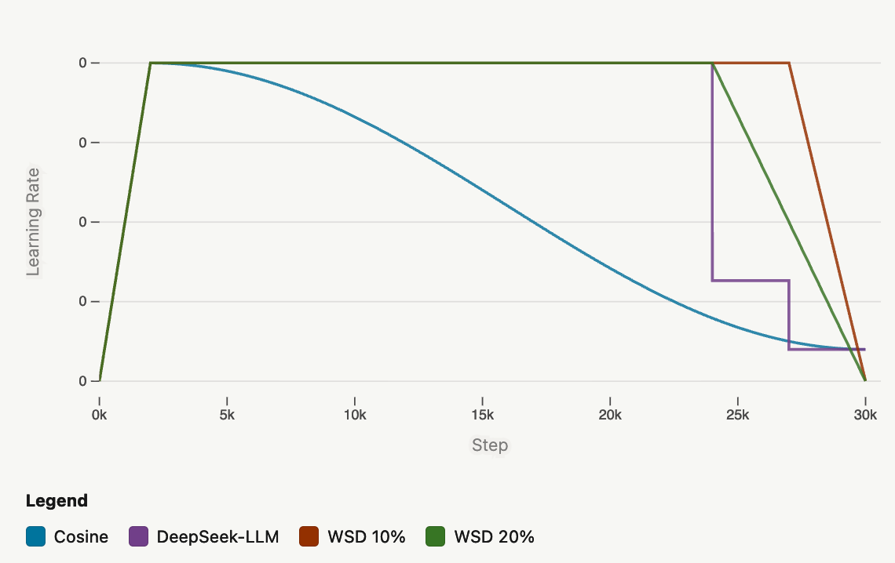
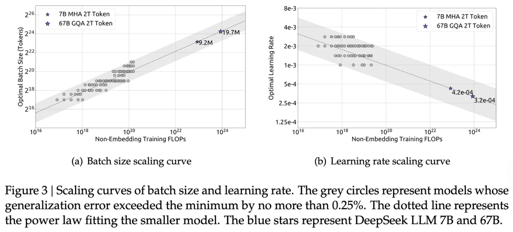
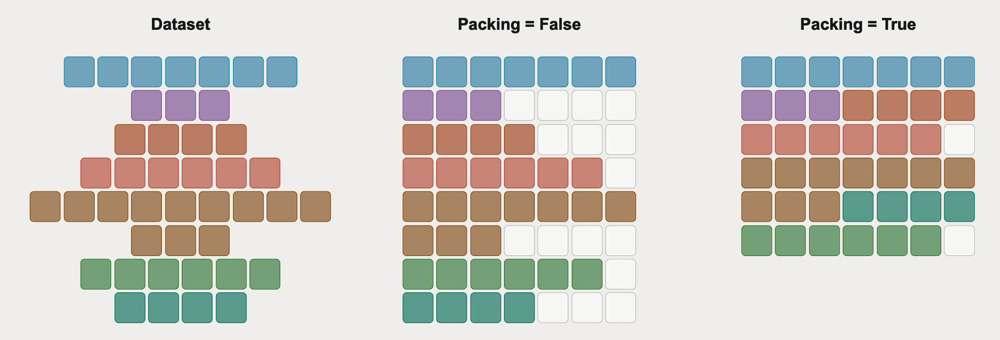
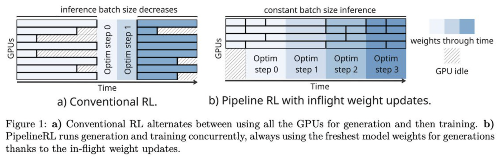
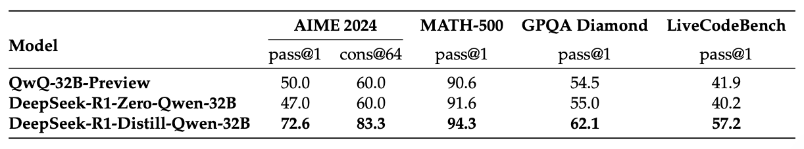

# [WIP] frontier model training methodologies

*Jan 1, 2026 • Alex Wa*

How do labs train a frontier, multi-billion parameter model? We look towards Hugging Face’s [SmolLM3](https://huggingface.co/spaces/HuggingFaceTB/smol-training-playbook#wrapping-up-post-training), Prime Intellect’s [Intellect 3](https://arxiv.org/abs/2512.16144), Nous Research’s [Hermes 4](https://arxiv.org/abs/2508.18255), OpenAI’s [gpt-oss-120b](https://arxiv.org/pdf/2508.10925), Kimi’s [Kimi K2](https://arxiv.org/pdf/2507.20534), and DeepSeek’s [DeepSeek-R1](https://arxiv.org/pdf/2501.12948). This blog is an attempt towards distilling the techniques, motivations, and considerations used to train their models with an emphasis on training methodology over infrastructure.

These notes are largely structured off of Hugging Face’s [SmolLM3 report](https://huggingface.co/spaces/HuggingFaceTB/smol-training-playbook#math-data) due to its extensiveness, and it is currently supplemented with notes from other reports including Intellect-3, gpt-oss-120b, Hermes 4, and DeepSeek (adding Kimi and Qwen soon). Also, these notes have not been thoroughly reviewed. Any errors are entirely my responsibility.

While this blog explores some infrastructure-related ideas like in-flight weight updates and multi-client orchestrators, t[here](https://huggingface.co/blog/faster-transformers) are many other ideas mentioned throughout those posts/blogs like expert parallelism and quantization. HuggingFace writes more about gpt-oss-120b’s infrastructure [here](https://huggingface.co/blog/faster-transformers).

---

## general practices

1. “Learn to identify what’s worth testing, not just how to run tests. Perfect ablations on irrelevant choices waste as much compute as sloppy ablations on important ones.”
2. Ablations need to be fast (faster iteration $\rightarrow$ more hypotheses tested) and reliable (need strong discriminative power because otherwise, it may be noise).
3. “The real value of a solid ablation setup goes beyond just building a good model. When things inevitably go wrong during our main training run (and they will, no matter how much we prepare), we want to be confident in every decision we made and quickly identify which components weren’t properly tested and could be causing the issues. This preparation saves debugging time and keeps our sanity intact. There’s nothing worse than staring at a mysterious training failure with no idea where the bug could be hiding.”
4. Choose an established baseline with good architecture and training setup design. These take years of iteration, and people have discovered common failure modes and instabilities.
5. There are a plethora of modifiable components (attention mechanisms and positional encodings to name a few), but follow the principle of derisking: “never change anything unless you’ve tested that it helps.”
6. In evals, look for monotonicity (score improvement), low noise (e.g. score resistance to random seeds), above-random performance (random-level performance for extended time frames isn’t useful), and ranking consistency (ranking of approaches should remain stable throughout training).
7. Prioritize evals! Between pre-training and post-training, core evals should be preserved, and their implementation should be finished long before the base model is finished training.
8. Balance exploration and execution. For methods, choose flexibility and stability over peak performance, set a deadline for exploration.

---

## architecture and set-up

Model families like DeepSeek, gpt-oss-120b, Kimi, OLMo, and SmolLM have vastly different architectures (dense vs MoE), attention mechanisms (MHA vs MLA vs GQA), position encodings (RoPE, partial RoPE, NoPE), among many others. Not all information about the models is publicly available.

When choosing architecture, HuggingFace suggests following a decision tree such that if one of these is true, then to choose a dense architecture:

- memory-constrained (since MoEs must have all experts loaded)
- new to LLM training (focus on basics)
- tighter timeline (simpler training with well-documented recipes)

### attention

To address the large KV-cache (an inference bottleneck and GPU memory hoarder) associated with MHA, researchers developed [multi-query attention](https://arxiv.org/abs/1911.02150) (MQA) and [grouped query attention](https://arxiv.org/abs/2305.13245) (GQA). In MQA, KV values are shared across all heads, but this comes at a cost of leaking attention capacity because heads can’t store information specialized for that head’s role. GQA softens this issue by sharing KV values across a small group of heads (e.g. 4). Another alternative is multi-latent attention (MLA) which stores a latent variable that can be decompressed/projected into KV values at runtime. This results in a KV-cache parameter count more comparable to GQA and performance stronger than MQA.

HuggingFace found that GQA with small groups beats MHA and that MHA beats MQA and GQA with 16 groups. Across benchmarks like HellaSwag, MMLU, and ARC, GQA with 2/4/8 groups does best.

### document masking

When pre-training, a common consideration is fixed sequence lengths since training uses tensors of the form [batch, sequence length, hidden], so with regards to batching and distributed training, GPUs are most happy when every example has the same sequence length. But due to variable document length and wanting to avoid padding which wastes compute, packing enables shuffling and concatenating documents within the same sequence to achieve the sequence length.

Causal masking means that for unrelated files $A$ and $B$ in the same batch, the tokens in $B$ can attend to the tokens in $A$, which degrades performance. With intra-document masking, the attention mask is modified so tokens can only attend to previous tokens within the same document. Many papers have found benefits relating to [long-context extension](https://arxiv.org/abs/2407.21783) and [some short context benchmarks](https://arxiv.org/abs/2410.02660).

HuggingFace saw small improvements on PIQA but otherwise no noticeable impact on short context tasks. But they observed that it became crucial for scaling from 4k to 64k tokens.

### embedding sharing

Input embeddings (token-to-vector lookup) and output embeddings (hidden states to vocab logits) are typically represented as separate matrices. In small language models, this can account for up to 20% of total parameters (e.g., Llama 3.2 1B). Tying them saves parameters, but input/output embeddings still represent different geometries, and frequent tokens can dominate representation learning.

HuggingFace found that on a 1.2B model, tied embeddings did comparably well despite having 18% fewer parameters, and that compared to an untied model also with 1.2B parameters (fewer layers), untied showed higher loss and lower downstream eval scores.

### positional encodings

[Rotary position embedding (RoPE)](https://arxiv.org/abs/2104.09864) is the most commonly used technique, encoding relative position as rotation angles. During attention, the dot product between their rotated positions directly encodes their relative distance.

*Figure 1: RoPE splits query/key vectors into pairs and rotates each pair by an angle proportional to position. From Su et al., 2021.*

As sequence length grows, rotation angles grow via $\theta= \text{position} \times \frac1{\text{base}^{\frac{k}{\text{dim}/2}}}$. This can be fixed by increasing the base frequency as the sequence length increases using methods like [ABF](https://arxiv.org/abs/2309.16039) or [YaRN](https://arxiv.org/abs/2309.00071).

More recently, [NoPE](https://arxiv.org/abs/2305.19466) (no position embedding) and [RNoPE](https://arxiv.org/abs/2501.18795), a hybrid method, have emerged. RNoPE alternates applying RoPE and NoPE on attention blocks, where RoPE handles local context and NoPE helps with longer-range information retrieval. HuggingFace adopts RNoPE + document masking because it provides the foundation for long-context handling.

### attention for long contexts

Alternative strategies for long-context tasks include:

- **Chunked Attention**: Divides the sequence into fixed-sized chunks. Used in [Llama 4](https://ai.meta.com/blog/llama-4-multimodal-intelligence/).
- **Sliding Window Attention (SWA)**: Every token can see up to $p$ positions back. Used in Gemma 3.
- **Dual Chunk Attention (DCA)**: Combines intra-chunk attention with a local window and broader inter-chunk attention. Qwen-2.5 used DCA to support context windows of up to 1 million tokens.

*Figure 2: five common types of attention. From HuggingFace.*

### MoE

MoEs (mixture of experts) replace the feed-forward layer with multiple MLPs (experts) and a router. This saves compute at inference time. Recent models like gpt-oss-120b and DeepSeek-V3 are sparse, with over 100 experts and around 10 active per token.

*Figure 3: Comparison of dense architecture and MoE architecture. From Sebastian Raschka.*

Shared experts absorb basic patterns so other experts can specialize. Load balancing is crucial to avoid efficiency drops; models use loss-based load balancers (LBL) or loss-free load balancing (DeepSeek-V3) to ensure expert utilization.

### hybrid models

Combining Transformers with RNN structures (like SSMs) is becoming popular to handle long contexts efficiently. [Mamba-2](https://arxiv.org/abs/2405.21060) is a notable example, used in hybrid models like [Nemotron-H](https://arxiv.org/abs/2504.03624). Hybrid models are increasingly common in upcoming releases like Qwen3-Next and Kimi Delta Attention.

---

## stability

### $z$-loss

Regularization added to cross-entropy loss that keeps logits from drifting to large magnitudes: $\mathcal{L} = \lambda \cdot \log^2(Z)$. HuggingFace found it didn't impact training loss significantly for their 1B model, so they omitted it to reduce overhead.

### removing weight decay from embeddings

Removing weight decay from embeddings can improve stability by preventing embedding norms from decreasing, which avoids large gradients in earlier layers due to the LayerNorm Jacobian.

### qk norm

Applying LayerNorm to query and key vectors before attention computation. While it prevents exploding logits, it can hurt long-context tasks by stripping the dot-product of its magnitude.

### other design considerations

- **Parameter Initialization**: Normalization initialization with clipping or $\mu$P (maximal update parametrization).
- **Activation Function**: SwiGLU is modern standard (Llama, GPT-OSS). Gemma2 uses GeGLU.
- **Width vs Height**: Deeper models typically outperform wider ones for language modeling.

---

## tokenizer

- **Digits**: Single-digit splitting is preferred for math/arithmetic patterns.
- **Vocabulary Size**: 50k (English-only) to 100k+ (multilingual). Larger vocabularies compress better but increase embedding parameters.
- **BPE**: Byte-pair encoding remains the de facto algorithm.

---

## optimizers and training hyperparameters

### adamW

Hyperparameters: $\lambda=0.1$ or $0.01$, $\beta_1=0.9$, $\beta_2=0.95$. Still the industry standard.

### muon

Treats the weight matrix as a singular object and updates based on NewtonSchulz iteration. It reduces axis-aligned bias and encourages exploration. Kimi K2 introduced **MuonClip** to stabilize attention logits.

*Figure 4: Left: a mid-scale training run on a 9B active, 53B total MoE where attention logits diverge quickly. Right: maximum logits for KimiK2 with MuonClip and 𝜏=100, where max logits eventually decays to a stable range after ~30% of the training steps. From Kimi K2.*

### learning rates

Cycles typically include warmup, stable phase, and decay. **WSD (Warmup-Stable-Decay)** is popular because it allows for easier ablations—one can retrain just the decay portion on existing checkpoints.

*Figure 5: Comparison of learning rate schedules: cosine annealing, WSD, and multi-step. From HuggingFace.*

### batch size

There is a critical batch size—too large leads to diminishing returns, too small underutilizes compute. Batch size should generally scale with learning rate as $\eta \sim \sqrt{k}$.

### scaling laws

Chinchilla scaling laws ($C \approx 6 \cdot N \cdot D$) guide parameter/token balance. Modern labs often "overtrain" models (e.g., Qwen 3 with 36T tokens) to maximize performance despite compute-optimal theories.

*Figure 6: Scaling curves of batch size and learning rate. From DeepSeek.*

---

## data curation and pre-training

### multi-stage training

Evolving the data mixture as training progresses. The final behavior of a model is heavily influenced by the data it sees at the end. High-quality data is often saved for these later stages.

### ablation

Smaller model (1B) ablations are used for architecture, but scale ablations are needed for data mixtures. Holden-out loss or validation sets help determine optimal proportions.

### pre-training data

- **SmolLM3**: Stages include high-quality injection and reasoning/Q&A. Used FineWeb-Edu, DCLM, Stack-Edu.
- **Hermes 4**: Uses DCLM, FineWeb, and synthetic data generated via DataForge (graph-based walkthroughs for QA and reasoning).

---

## mid-training

Intermediary step used to shape specific skills like coding or reasoning. Often includes a separate long-context stage (scaling from 4k to 32k, 64k, 128k). Upsampling long documents and using distilled reasoning tokens (e.g., from DeepSeek-R1) are common tactics.

---

## post-training

### evals

Focused on **Knowledge** (GPQA, SimpleQA), **Math** (AIME, MATH-500), **Code** (LiveCodeBench, SWE-bench), **Alignment** (LMArena, AlpacaEval), and **Tool Calling** (TAU-Bench).

### post-training data

- **Intellect 3**: Uses `prime-rl`, Environment Hub for math/science/logic, and synthetic trajectories for agentic behavior.
- **Hermes 4**: 300k prompts (STEM/Code), rejection sampling against verifiers using Atropos.
- **Kimi K2**: Focuses on tool-use via ACEBench-style data synthesis, real MCP tools, and synthetic scenarios.

### chat template

Templates like Qwen3 and Harmony (GPT-OSS) support tool calling and reasoning. GPT-OSS uses "channels" (final, commentary, analysis) for CoT/tool invisibility.

### sft (supervised fine-tuning)

Typically the first step. Uses distillation from stronger models. Data mixtures like **Nemotron-Post-Training** or **AM-DeepSeek-R1-Distilled** are common.

### sequence packing

Improves efficiency by packing multiple sequences into single batches. While efficient, it can alter training dynamics (fewer gradients) and may hurt performance on very small datasets.

*Figure 7: Comparison of sequence packing strategies. From HuggingFace.*

### preference optimization (PO)

- **DPO**: Direct Preference Optimization.
- **KTO**: Updates based on desirable/undesirable labels (binary).
- **ORPO/APO**: Alternatives that integrate PO with SFT or push preferred outputs specifically.

### RL (reinforcement learning)

- **RLHF**: From human feedback.
- **RLVR**: With verifiable rewards (Math/Code).
- **GRPO**: Group Relative Policy Optimization (DeepSeek).
- **In-flight updates**: Generating rollout batches and updating sequentially to maximize throughput.

*Figure 8: Comparison of conventional RL and in-flight updating. From Pipeline RL paper.*

*Figure 9: Comparison of DeepSeek-R1-distilled and RL Models on Reasoning-Related Benchmarks. From DeepSeek.*

### RLVR and rubrics

To prevent "reward hacking" (generating overly long thinking traces to get higher rewards), models use **length penalties** or "overlong completion penalties."

### alternatives to RL

**On-policy distillation** is a cheaper alternative to RL where a student model's KL divergence from a teacher model provides the learning signal on sampled responses.

---

## behaviors and safety

### safety testing

Includes adversarial fine-tuning, jailbreak testing (StrongReject), and evaluations for biased content (BBQ).

### behaviors and latent capabilities

Hermes 4 uses a first-person identifier (`me`) to adopt a peer-like persona, resulting in lower refusal rates and higher behavioral plasticity compared to policy-rigid models like GPT-OSS.

---

## the training marathon

Infrastructure prep (Slurm, GPU Fryer) and automated evaluation logging are critical.

- **Vanishing Throughput**: Often caused by data storage bottlenecks (fetching shards from S3) or inefficient dataloaders.
- **Noisy Loss**: Can be caused by sequential data reading—reshuffling offline is a common fix.
- **Tensor Parallelism**: Improper random seed initialization for TP ranks can lead to loss of diversity and poor convergence.
- **Multi-client Orchestrator**: Necessary to prevent throughput plateaus when scaling inference nodes for RL rollouts.

---

### Alex Wa's Blog

- [alex [dot] wa [at] yale [dot] edu](mailto:alex [dot] wa [at] yale [dot] edu)
- [djdumpling](https://github.com/djdumpling)
- [alex-wa](https://www.linkedin.com/in/alex-wa)
- [_djdumpling](https://www.twitter.com/_djdumpling)
