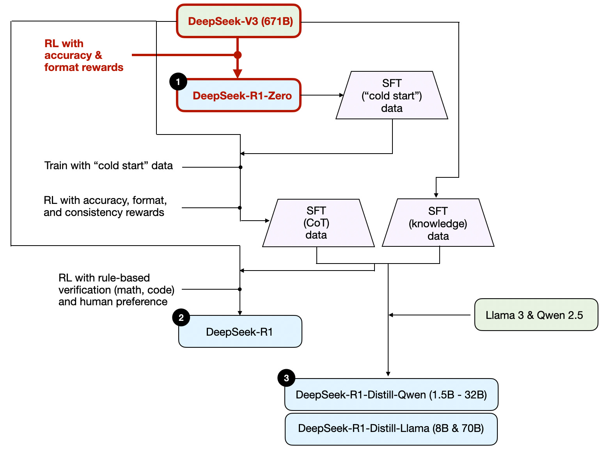

# LLMs — Reference & Revision Notes

> Single consolidated reference across tokenization, architecture, serving, sampling, scaling, and reasoning.  
> Add new notes under the relevant `###` heading. Split into separate files only when a section grows unwieldy.

---

## Table of Contents

- [[#1. Tokenization]]
  - [[#BPE (Byte-Pair Encoding)]]
  - [[#WordPiece]]
  - [[#Comparison BPE vs WordPiece]]
- [[#2. Transformer Architecture]]
  - [[#Attention — Q-K-V Intuition]]
  - [[#Multi-Head Attention]]
  - [[#Normalization]]
  - [[#Positional Embeddings]]
  - [[#Activation Functions]]
  - [[#Attention Variants]]
  - [[#Mixture of Experts (MoE)]]
- [[#3. KV Cache & Sparse Attention]]
  - [[#KV Cache Intuition]]
  - [[#DeepSeek Sparse Attention (V3.2)]]
  - [[#Multi-Head Latent Attention (MLA)]]
- [[#4. Sampling & Decoding]]
  - [[#How LLMs Generate Text]]
  - [[#Generation Config Params]]
  - [[#Decoding Strategies]]
- [[#5. Inference Serving]]
  - [[#Continuous Batching]]
  - [[#vLLM Anatomy]]
  - [[#MFU & Activation Checkpointing]]
- [[#6. Scaling Laws]]
- [[#7. Reasoning & RL for LLMs]]
  - [[#Terminology]]
  - [[#LLM ↔ RL Mapping]]
  - [[#Inference-Time Compute Methods]]
  - [[#DeepSeek R1 Family]]
  - [[#GRPO & Training Updates (V3.2)]]

---

## 1. Tokenization

📘 References:
- [Summary of Tokenizers | HuggingFace](https://huggingface.co/docs/transformers/tokenizer_summary)

The choice of tokenizer balances three dials:
1. **Statistical objective** — how subwords are formed during training
2. **Operational constraints** — speed, implementation simplicity, memory
3. **Dataset characteristics** — monolingual vs multilingual

> GPT-style autoregressive models use BPE; it scales easily on web-sized corpora and merges common patterns efficiently.

---

### BPE (Byte-Pair Encoding)

> Subword tokenization used in **decoder-only** models (GPT). Guarantees every character is representable — critical for open-vocabulary generation.

**Training Algorithm**
Start by splitting text into characters, then iteratively merge the most frequent adjacent pair until target vocabulary size is reached.

```
t h e _ c a t  →  t h e_ c a t  →  the_ c a t  →  the_ cat  →  the_cat
```

> **GPT-2 / RoBERTa trick**: tokenize into bytes instead of Unicode characters — no unknown tokens, handles emojis/punctuation natively.

**FAQ**
> Q: What is the stopping criteria for merging in BPE training?  
> A: _[to fill]_

---

### WordPiece

> Used in **encoder-only** models (BERT). Improves on BPE with a probabilistic objective and continuation markers (`##ing`) for cleaner token boundaries.

**Merge Objective**

Instead of raw frequency, WordPiece scores candidate merges as:

$$
\text{score} = \frac{\text{freq}_{\text{pair}}}{\text{freq}_{\text{first}} \times \text{freq}_{\text{second}}}
$$

Favours pairs that co-occur frequently but are individually rare → high semantic information per token.

> Unlike BPE, WordPiece doesn't merge greedily; it maximises corpus likelihood.

---

### Comparison: BPE vs WordPiece

| Property | BPE | WordPiece |
|---|---|---|
| Objective | Frequency-driven | Probability-driven |
| Model type | Decoder-only (GPT) | Encoder-only (BERT) |
| Merging | Greedy | Likelihood-maximising |
| Markers | None | `##` continuation |
| Best for | Generative tasks | Bidirectional contexts |

---

## 2. Transformer Architecture

📘 References:
- [Transformer Explainer](https://poloclub.github.io/transformer-explainer/)
- [Transformer FLOPs | Adam Casson](https://www.adamcasson.com/posts/transformer-flops)
- [Transformer Inference Arithmetic | kipply](https://kipp.ly/transformer-inference-arithmetic/)

---

### Attention — Q-K-V Intuition

The key to understanding attention is the role of the **Query, Key, and Value** matrices and the logical flow to the final output.

- **Query (Q)**: "Which tokens are relevant to me?" — probes other tokens
- **Key (K)**: "What information do I contain?" — being probed
- **Value (V)**: "What do I contribute if attended to?"

$$
\begin{gather}
\text{Compatibility Score} = QK^{T} \\
\text{Normalised Score} = \frac{QK^{T}}{\sqrt{d_{k}}} \\
\text{Attention Weight} = \text{softmax}\!\left(\frac{QK^{T}}{\sqrt{d_{k}}}\right) \\
\text{Output} = \text{softmax}\!\left(\frac{QK^{T}}{\sqrt{d_{k}}}\right)V
\end{gather}
$$

---

### Multi-Head Attention

```
input token = n
model_dim = 768
n_head = 8

X = [n, 768]
W_k, W_q, W_v = [768, 768]

Q = K = V = X.W = [n, 768] . [768, 768]

Split among 8 heads:
[n, 768] --> [n, 8, 96] --> [8, n, 96]
# Tensor reorder so BMM performs independent matmul per head
```

---

### Normalization

**Why normalize?** Keeps activation values stable across matrix multiplications.

$$
\hat{a} = \frac{a - \mu}{\sigma}
$$

#### Batch Norm vs Layer Norm

**Batch Normalization**: computes per-dimension mean/SD over the mini-batch (across batch dimension). Unreliable for small batch sizes — problematic at inference.

**Layer Normalization**: computes mean/SD over the embedding dimension (across features). Works independently per sample — preferred for transformers.

$$
\begin{align}
\mu &= \frac{1}{H} \sum_{i=1}^{H} x_i,
& \sigma^2 &= \frac{1}{H} \sum_{i=1}^{H} (x_i - \mu)^2 \\
\hat{x}_i &= \frac{x_i - \mu}{\sqrt{\sigma^2 + \varepsilon}},
& y_i &= \gamma_i \hat{x}_i + \beta_i
\end{align}
$$

#### RMSNorm

Drops the mean-centering step from LayerNorm — simpler and faster:

$$
\begin{align}
\text{RMS} &= \sqrt{\frac{1}{H} \sum_{i=1}^{H} x_i^2 + \varepsilon},
& y_i &= \gamma_i \frac{x_i}{\text{RMS}}
\end{align}
$$

📘 Reference: [RMSNorm vs LayerNorm | Sebastian Raschka](https://magazine.sebastianraschka.com/i/170506328/rmsnorm-replaces-layernorm)

---

### Positional Embeddings

**Absolute Positional Encoding (APE)**: additive injection of absolute position at input. Simple but doesn't generalise to sequences longer than training length.

**Relative Positional Encoding (RPE)**: encodes distance between tokens rather than absolute positions. Better generalisation.

**Rotary Positional Encoding (RoPE)**
📘 [RoPE: math & implementation | GitHub](https://github.com/aju22/RoPE-PyTorch/blob/main/RoPE.ipynb)

Hybrid of APE and RPE. Injects positional information at **every layer** rather than just the input:
1. Encodes absolute position into a rotation matrix
2. Injects relative position directly into the self-attention operation

Result: better long-sequence performance and natural decay of inter-token dependency as relative distance increases.

---

### Activation Functions

Used in the Feed-Forward sublayer of transformers. Modern models have moved away from ReLU:

1. **GeLU** — Gaussian Error Linear Unit
2. **Swish / SwiGLU** — replaces GeLU in most modern architectures

📘 Reference: [SwiGLU replaces GeLU | Sebastian Raschka](https://magazine.sebastianraschka.com/i/170506328/swishswiglu-replaces-gelu)

> **Dropout** is largely no longer used in LLM architectures. Validated experimentally via small-scale GPT-2 replication runs.  
> 📘 [Removing Dropout | Sebastian Raschka](https://magazine.sebastianraschka.com/i/170506328/removing-dropout)

---

### Attention Variants

#### Grouped Query Attention (GQA)
📘 [GPT-2 to Llama 3 conversion guide | GitHub](https://github.com/rasbt/LLMs-from-scratch/blob/main/ch05/07_gpt_to_llama/converting-llama2-to-llama3.ipynb)

#### Sliding Window Attention (SWA)
Each token only attends to a fixed-width window of past tokens — reduces quadratic complexity.  
📘 [SWA history & brief | Sebastian Raschka](https://magazine.sebastianraschka.com/i/170506328/sliding-window-attention)

---

### Mixture of Experts (MoE)
📘 [Visual Guide to MoE | Maarten Grootendorst](https://newsletter.maartengrootendorst.com/p/a-visual-guide-to-mixture-of-experts)

_[to expand]_

---

## 3. KV Cache & Sparse Attention

📘 References:
- [Speeding up the GPT — KV Cache | Dipkumar](https://dipkumar.dev/posts/gpt-kvcache/)

---

### KV Cache Intuition

**Extending the Q-K-V mental model:**

- **K and V are static per token+position** — they depend only on the token and its position, not future tokens. So once computed, they can be cached.
- **Q is dynamic** — every new token generates a new Query that attends over all cached Keys.
- **Attention score is NOT cached** — it's recomputed at every step using the new Q and the full cached K.

**Library Analogy**

| Element | Library Analogy |
|---|---|
| Key (K) | Printed title of a book — static, doesn't change |
| Value (V) | Text inside the book |
| Query (Q) | A student's research topic |
| Attention Score | Student scanning titles to find relevant books |
| KV Cache | The shelf of books — reused for every new student |

> Why cache? When a second student arrives, you don't reprint the books. Only the search query (Q) changes.

---

### DeepSeek Sparse Attention (V3.2)

Reduces attention complexity from **O(L²)** to **O(L·k)**, where k ≪ L is the number of selected tokens.

Similar idea to Sliding Window Attention, but instead of a fixed window, uses a learned selection mechanism.

#### Lightning Indexer

Computes relevance scores for each new query against all previous tokens using compressed representations (from MLA):

$$
\begin{gather}
I_{t,s} = \sum_{j=1}^{H^I} w_{t,j} \, \mathrm{ReLU}(q_{t,j} \cdot k_{s}) \\
t: \text{current token position} \quad s: \text{previous token position} \quad q_{t,j}: \text{query vector for head } j
\end{gather}
$$

Runs only over Queries — Keys are already in compressed MLA form.

#### Token Selector

Picks top-k tokens by relevance score and constructs a **sparse attention mask** — all other tokens are ignored.

---

### Multi-Head Latent Attention (MLA)

Introduced in DeepSeek V2. Compresses K and V tensors into a **low-dimensional latent space** before storing in KV-cache. At inference, compressed tensors are projected back to full size before attention.

- **Benefit**: dramatically smaller memory footprint for KV cache
- **Cost**: one extra matrix multiplication per forward pass (acceptable tradeoff)

---

## 4. Sampling & Decoding

📘 References:
- [Dummy's Guide to Modern LLM Sampling](https://rentry.org/samplers)
- [Generation Configurations | Huyen Chip (2024)](https://huyenchip.com/2024/01/16/sampling.html)
- [HuggingFace Docs: text_generation](https://huggingface.co/docs/transformers/main/main_classes/text_generation)
- [Grammar-Based Sampling | Michael Giba](https://michaelgiba.com/grammar-based/index.html)

---

### Key Terms

| Term | Meaning |
|---|---|
| Logits | Raw, unnormalized scores output by the model for each token |
| Softmax | Converts logits into probabilities summing to 1 |
| Entropy | Measures uncertainty in distribution; high entropy → more randomness |
| Perplexity | How "surprised" the model is by text; lower is better |
| n-gram | Contiguous sequence of n tokens |

---

### How LLMs Generate Text

> At each step, the model predicts a probability distribution over vocabulary for the next token. Sampling introduces controlled randomness to pick one token.

```
repeat until [EOS]:
    p = model(next_token_probs)
    next_token = sample_from(p)
    output.append(next_token)
```

---

### Generation Config Params

These manipulate logits **before** sampling:

**1. Temperature**  
Scales logits before softmax. T < 1 → deterministic. T > 1 → creative.
$$
p_i = \frac{e^{z_i / T}}{\sum_j e^{z_j / T}}
$$

**2. top_k**  
Hard-truncate to K highest-logit tokens; everything else → −∞.
$$
\tilde{z}_i =
\begin{cases}
z_i & i \in S \\
-\infty & i \notin S
\end{cases}
$$

**3. top_p (nucleus sampling)**  
Keep smallest set of tokens whose cumulative probability ≥ top_p.
$$
\sum_{i \in S} p_i \geq p_{\text{cut}}
$$

**4. min_p**  
Dynamic threshold relative to the most likely token's probability:
$$
\theta \geq \min\_p \times p_{\max}
$$

**5. epsilon_cutoff**  
Simple floor filter — remove tokens below threshold ε.

**6. repetition_penalty**  
Multiplicative logit transform to reduce probability of already-generated tokens:
$$
z'_i = \begin{cases}
z_i \cdot r & \text{if } z_i < 0 \\
z_i / r & \text{if } z_i \ge 0
\end{cases}
\quad \text{for tokens already generated}
$$

**7. Presence Penalty** *(not in HF/transformers)*: _[to fill]_  
**8. Frequency Penalty** *(not in HF/transformers)*: _[to fill]_

---

### Decoding Strategies

**Greedy Decoding**  
At each step, pick the highest-probability token.  
Drawback: misses high-probability sequences hidden behind low-probability early tokens.

**Beam Search Decoding (BSD)**  
Maintains multiple beams (candidate sequences), selects the one with highest overall probability.

Problems with BSD:
- **Over-optimised for likelihood** — high-P sequences are often bland and repetitive; high-P ≠ human preference
- **Mode collapse** — beams often converge to similar continuations
- **Length bias** — BSD favours short sequences without explicit normalisation

How sampling methods address BSD problems: _[to expand — Temperature, Top-K, Top-P, Min-P, penalties, Contrastive Search]_  
📘 [ChatGPT thread](https://chatgpt.com/s/t_68aca2534e6081918222b8007ec86036)

**Diverse Beam Search**: _[to expand]_

**Speculative Decoding**  
📘 [HuggingFace detailed blog](https://huggingface.co/blog/assisted-generation)  
_[to expand]_

**Contrastive Search**: _[to expand]_

**DoLA (Decoding by Contrasting Layers)**: _[to expand]_

---

## 5. Inference Serving

📘 References:
- [Continuous Batching | HuggingFace](https://huggingface.co/blog/continuous_batching)

---

### Continuous Batching

> **Continuous Batching = Ragged Batching + Dynamic Scheduling**

#### Ragged Batching

- **Problem**: Traditional batching requires rectangular tensors. Mixing short and long sequences wastes GPU memory via padding tokens.
- **Solution**: Concatenate all tokens into a single 1D stream; use attention masks to separate sequences logically.
- **Result**: Zero-padding eliminated — every bit of compute is used on real data.

#### Dynamic Scheduling

- **Problem**: Static batching waits for the longest sequence in a batch to finish before admitting new requests.
- **Solution**: Eject a sequence as soon as it hits `<eos>` and immediately admit the next queued request.

Together, these allow a new prompt of arbitrary length to be inserted into an in-progress batch of decoding sequences.

#### Connecting to OLMo-3

- GPUs can't process tensors of different shapes in a single batch → padding required → continuous batching addresses this.
- **Active Sampling** in OLMo-3: algorithmic efficiency on top — removes zero-grad batches and replaces them with new prompts, keeping GPU at maximum batch capacity.

---

### vLLM Anatomy

📘 References: vLLM Anatomy blog, internal ChatGPT thread

**V0 Scheduler** handles two request types:
1. **Prefill Request** — processing the full input prompt
2. **Decode Request** — autoregressive token generation

_[to expand — PagedAttention, memory management]_

---

### MFU & Activation Checkpointing

#### Model FLOPs Utilization (MFU)

Proposed in Google's PaLM paper. Measures training efficiency:

$$
\text{MFU} = \frac{C \cdot D}{P}
$$

Where C = model FLOPs per token, D = observed tokens/second, P = theoretical peak FLOPS.

```python
# Example: A100 (fp16/bf16) theoretical peak = 312 TFLOPS
# FLOPS(forward + backward) = 6N, N = 125M params, throughput = 200k tok/s

MFU = (6 × 125e6) × (200e3) / (312e12) ≈ 0.48 → 48%
```

#### Activation Checkpointing (Rematerialisation)

- Forward pass stores intermediate activations needed for backprop — massive memory cost at scale.
- **Activation checkpointing**: discard most activations during forward pass; save only a few checkpoints.
- At backprop, recompute activations from the nearest checkpoint.
- **Trade-off**: saves GPU memory, but inflates hardware FLOPs utilisation (HFU) since some computation is done twice.

---

## 6. Scaling Laws

📘 References:
- [Transformer FLOPs | Adam Casson](https://www.adamcasson.com/posts/transformer-flops)
- [Transformer Inference Arithmetic | kipply](https://kipp.ly/transformer-inference-arithmetic/)
- [Scaling Laws | Dario Amodei × Lex Fridman](https://www.youtube.com/watch?v=GrloGdp5wdc)
- [Scaling Laws are Memorization, not Intelligence — Chollet](https://www.youtube.com/watch?v=rl7B-LHiaNo)
- [AI Can't Cross This Line](https://www.youtube.com/watch?v=5eqRuVp65eY&t=1s)

---

**Power Law**: a functional relationship where a relative change in one quantity produces a proportional change in the other, raised to a constant exponent.

$$
\text{Power Law} \to y = a \cdot x^{p}
\qquad
\text{Inverse Power Law} \to y = a \cdot \left(\frac{1}{x}\right)^{p}
$$

> *"With enough training data, scaling of validation loss should be approximately a smooth power law as a function of model size."*

---

**OpenAI Scaling Law**: test loss follows a power law w.r.t. parameters, dataset size, and compute. However, their experiments fixed dataset size at 300B tokens → models were undertrained.

**Chinchilla**: varied both parameters and dataset size. Concluded same power law, but proposed a **compute-optimal regime** requiring balanced scaling of both — not just parameters.

---

**The log-log scale trap**: scaling law plots shown on log-log axes look like exponential improvement, but converting to linear scale reveals power law decay — meaning returns flatten quickly. Each doubling of compute only reduces test loss by a small fixed percentage.

---

**Perplexity vs Downstream Benchmarks**: Scaling law progress is measured by perplexity (test loss). But small perplexity improvements often don't translate to meaningful accuracy gains on downstream benchmarks. Practitioners therefore track benchmark accuracy, not perplexity.

---

**Width vs Depth**  
📘 [Width vs Depth tradeoffs | Sebastian Raschka](https://magazine.sebastianraschka.com/i/170506328/width-versus-depth)  
_[to expand]_

---

## 7. Reasoning & RL for LLMs

---

### Terminology

#### Process Reward Model (PRM)

A classifier/regression model that scores **intermediate reasoning steps**, not just the final answer.

**Use cases:**
- Steer search — pick which partial solution branch to extend
- Rerank candidates — Best-of-N with step-level scores
- Train reasoners — denser learning signal than binary correct/incorrect

**Training methods:**
1. Human annotation of reasoning steps
2. Automatic labelling via verifier (calculator, compiler)
3. Distillation / self-play generation — label prefixes by rollout success rate (see Note N1)

**Why PRMs fail:**
- **Reward hacking** — generator learns steps that look good to PRM but aren't useful
- **Miscalibration on hard/OOD problems** (see Note N2)
- Noisy PRM amplifies noise during search — confidently follows wrong branches

---

#### Note N1: PRM Training via Self-Play / Distillation

Goal: train PRM to estimate P(correct final answer | prefix).

Method:
1. Sample full solution trajectories from LLM
2. Check final correctness (ground truth / verifier)
3. Label each trajectory as successful or not
4. Train PRM to predict: $P(\text{correct final answer} \mid \text{prefix})$

> This is Monte Carlo value learning: estimate how promising a reasoning prefix is by observing how often rollouts from it succeed.

Limitations: doesn't solve miscalibration — distribution mismatch, label noise from low-quality LLM solutions, rare structures on hard problems.

---

#### Note N2: PRM Miscalibration on Hard / OOD Problems

PRM is "calibrated" if its scores correspond well to actual outcome probability.

**Hard Problems**: long, non-linear chains of thought; small early mistakes drastically change final outcome. PRM may assign high scores to prefixes that superficially resemble training examples.

**OOD Problems**: if a prefix is unlike anything in PRM training data:
- Overconfident in wrong direction → search expands along wrong path
- Underconfident everywhere → wastes compute on dead ends
- Blind spots → entire problem classes solved poorly

Causes: generator explores reasoning space PRM never saw; inadequate domain coverage in training.

---

### LLM ↔ RL Mapping

| LLM / Reasoning Term | Classical RL Term | Intuition |
|---|---|---|
| Generator / LLM | Policy | Stochastic policy; tokens are actions |
| Prompt / Partial CoT | State | Each generated token transitions to a new state |
| Next token / reasoning step | Action | Discrete actions in a huge action space |
| Final answer correctness | Terminal reward | Sparse — given only at episode end |
| Verifier reward | Env reward | Ground truth RL signal; ideally not learned |
| ORM | Terminal reward estimator | Scores only complete trajectories |
| PRM | Dense reward / value approximator | Scores intermediate steps |
| PRM miscalibration | Value function error | Breaks on hard / OOD problems |
| Best-of-N / self-consistency | Monte Carlo eval + selection | Sample multiple trajectories; no learning |
| Tree of Thought | Tree search | Explicit search over action/state tree |
| MCTS-style reasoning | Monte Carlo tree search | — |
| Value model / verifier | Critic | Expected return from a state |
| Self-critique / self-reflection | Policy improvement | Model reviews trajectory after detecting low value |
| Self-backtracking | Rollback | Learned ability to abandon low-value branches |
| Thinking tokens / reasoning budget | Planning horizon / compute budget | — |
| Supervised reasoning traces | Imitation learning | Learn policy from expert trajectories |
| PPO-style RLHF | Policy gradient RL | Token-level policy optimisation |
| Distillation from search | Policy distillation | Train policy to imitate expensive search outputs |
| Sample many → label prefix | Monte Carlo value estimation | Estimate state value by rollout success frequency |

---

### Inference-Time Compute Methods

#### s1: Simple Test-Time Scaling

- **Approach 1**: Introduces a "wait" token — a more structured version of "think step by step" — to control output length.
- **Approach 2**: Sequential scaling (budget forcing) found more effective than parallel techniques (majority voting over independent completions).
  - Caveat: doesn't compare to more sophisticated parallel methods like beam search or best compute-optimal search (per Google's paper on test-time compute scaling).

#### Self-Backtracking — "Step Back to Leap Forward"

📘 [arxiv:2502.04404](https://arxiv.org/abs/2502.04404)

Proposes a self-backtracking mechanism where the LLM learns **when and where to backtrack** during training and inference:
- **Training**: model learns to recognise sub-optimal paths using a backtrack token
- **Inference**: tree-based search using backtracking to explore alternative solution paths

---

### DeepSeek R1 Family

<div style="text-align:center;">
  
  <em>Development process of DeepSeek's three reasoning models from the R1 paper</em>
</div>

#### Cold Start in SFT

Cold start = seeding RL training with a small dataset of CoT examples before scaling up.

Without it, directly applying RL to a pre-trained base model produces unreadable, hard-to-verify CoT reasoning. A small high-quality CoT dataset is used for SFT first, producing an interim model that generates structured, human-readable reasoning steps.

**R1 lifecycle:**
1. **R1-Zero**: pure RL on DeepSeek V3 base model — discovers reasoning behaviour, but CoT traces are messy
2. **Interim model**: cold start SFT on V3 base
3. **Synthesis**: R1-Zero + interim model used to generate large CoT corpus (via rejection sampling and filtering)
4. **R1**: trained on the synthesized corpus

#### DeepSeek R1-Zero

Built on DeepSeek V3 base, pure RL fine-tuned with:
- **Accuracy Reward**: LeetCode compiler for code; deterministic system for math
- **Format Reward**: LLM judge to ensure structured output format

Skips SFT fine-tuning stage entirely.

#### DeepSeek R1

_[to fill]_

#### DeepSeek R1-Distill-Qwen

Distillation here ≠ classical knowledge distillation (student trained on teacher logits). Instead: **instruction fine-tuning smaller LLMs** on R1-generated reasoning traces.

Distilled models far outperform pure-RL models (R1-Zero, QwQ-32B-Preview) on benchmarks — suggesting emergent reasoning can transfer via SFT on high-quality traces.

---

### DeepSeek Math V2 — Self-Verification + Self-Refinement

Developed specifically for math / theorem proving. Uses a three-model setup:

> **LLM 1 (Student)**: generates proofs  
> **LLM 2 (Verifier / TA)**: LLM-based proof verifier (PRM-style)  
> **LLM 3 (Meta-Verifier / Professor)**: validates the verifier's feedback

#### Self-Verification

- **Why a separate verifier?** DeepSeek R1 didn't use PRM due to limited advantage vs. computational overhead in large-scale RL. Math V2 revisits this as "self-verification."
- **Training LLM 2**: SFT DeepSeek V3.2-Exp on reasoning data, then RL with format reward + score reward (vs. human expert annotation).
- **Meta-Verifier (LLM 3)**:
  1. Initial verifier generates scores + analyses (mix of good and hallucinated)
  2. Human mathematicians QA the analyses
  3. Meta-verifier trained on this annotated data
  4. Used only during verifier development — not at inference

The generator-verifier loop forms a GAN-like dynamic: stronger verifier → better proofs → stronger verifier.

#### Self-Refinement

LLM acts on verifier feedback to revise its answer. At inference, the same model acts as both generator and verifier — the separate verifier was only needed during training to build a generator strong enough to apply the learned rubrics to its own output.

---

### GRPO & Training Updates (V3.2)

#### Original DeepSeek R1 Rewards

- Format reward
- Language consistency reward
- Main verifier reward (answer correctness)

#### V3.2 Reward Modifications

- **Reasoning & agent tasks**: rule-based output reward, length penalty, language consistency reward
- **General tasks**: Generative Reward Model (LLM-as-Judge)

---

#### GRPO Updates — DAPO & Dr. GRPO (also adopted in OLMo-3)

| # | Update | Source | Description |
|---|---|---|---|
| 1 | Zero Gradient Signal Filtering | DAPO | Remove groups with identical rewards (zero SD) — avoid training on zero-gradient samples |
| 2 | Active Sampling | DAPO | Dynamic sampling replaces zero-gradient samples to maintain batch size |
| 3 | Token-level Loss | DAPO | Normalise loss by total tokens across batch (not per-sample) — avoids length bias |
| 4 | No KL Loss | DAPO + Dr. GRPO | Removing KL allows less strict policy updates; avoids over-optimisation |
| 5 | Clip Higher | DAPO | Upper bound clipping term slightly higher than lower — enables larger updates |
| 6 | Truncated Importance Sampling | — | Adjusts for log-probability differences between inference and training engines |
| 7 | No SD Normalisation | Dr. GRPO | Removes per-group SD normalisation from advantage calculation — eliminates difficulty bias |

#### V3.2 Additional GRPO Modifications

1. **Domain-specific KL**: KL term weight tuned per domain (hyperparameter). Very weak/zero KL works best for math.
2. **Unbiased KL estimate**: Reweights KL term with the importance ratio used in the main loss — aligns KL gradient with the fact that samples come from old policy.
3. **Off-policy sequence masking**: Drops sequences with negative advantage and excessive policy drift — prevents learning from stale/off-policy data.
4. **MoE routing preservation**: Logs expert routing during rollout, forces same routing during training — gradients update the experts that actually produced the sampled answers.
5. **Original GRPO advantage normalisation retained**: Unlike Dr. GRPO (removes SD norm) and DAPO (token-level loss), V3.2 keeps original GRPO normalisation.

---

### Inference-Time Scaling — DeepSeek's Position

DeepSeek R1 technical report categorises PRM and MCTS under "unsuccessful attempts" — not explicitly used inside the model.

However, inference-time scaling is typically applied at the **application layer**, not inside the LLM itself:

| Layer | Methods |
|---|---|
| Within LLM | Longer natural generation, thinking tokens |
| Application layer | Best-of-N, self-consistency, critique-and-revise, tool-augmented loops, MCTS / tree search |

DeepSeek may still use application-layer methods in their product pipeline despite the report's framing.

---

*Last restructured: {{date}}*
