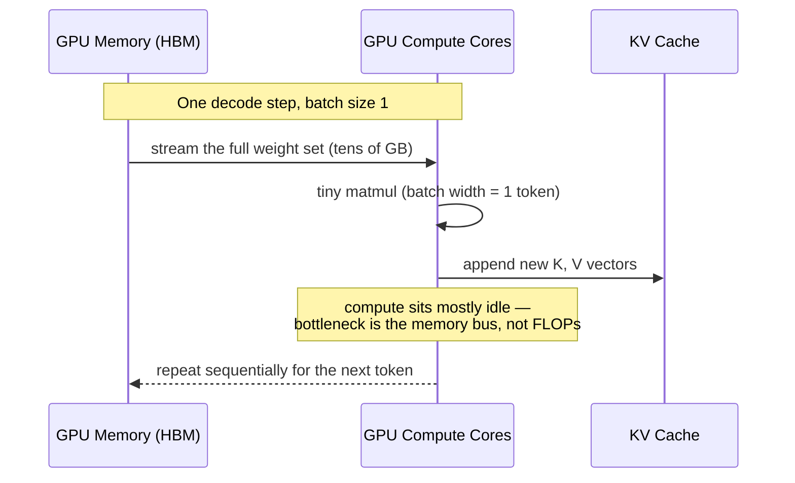
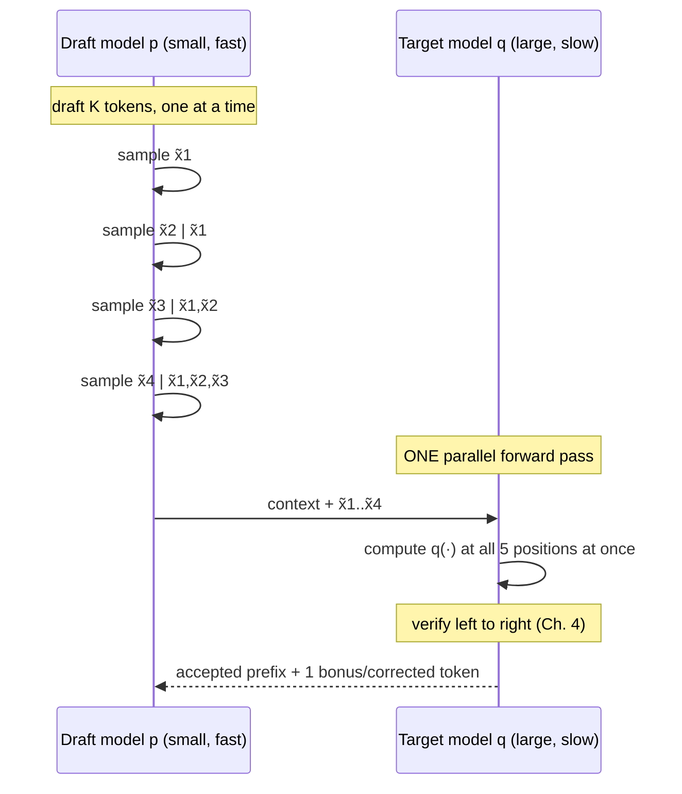
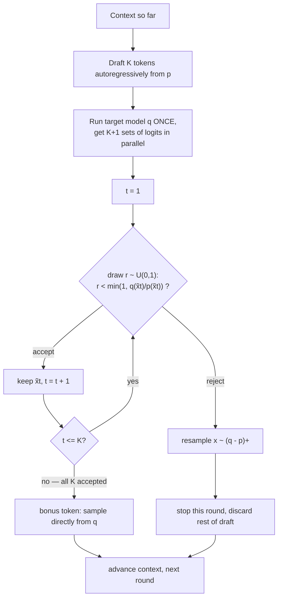
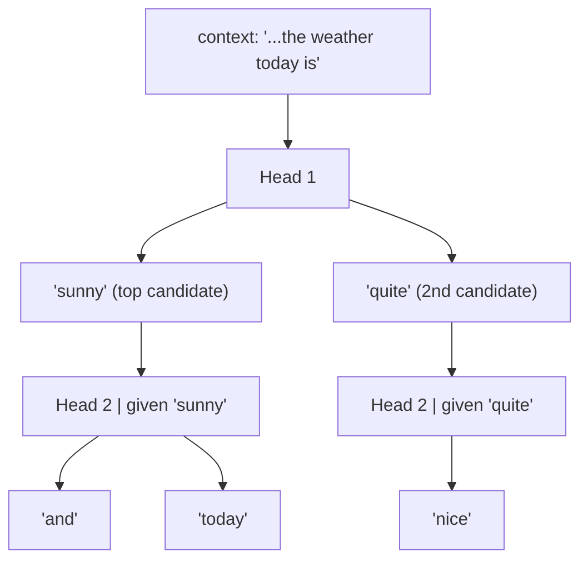

### A chapter-by-chapter walkthrough

_Grounded in: Chen et al., "Accelerating Large Language Model Decoding with Speculative Sampling" (DeepMind, arXiv:2302.01318); the IBM/PyTorch "Hitchhiker's Guide to Speculative Decoding"; and vLLM's speculative decoding feature set._

---

## Chapter 1 — Why Decoding Is Slow in the First Place

Before speeding anything up, you need to know exactly what's slow and why.

When a transformer generates text, it does so one token at a time. To produce token _n+1_, the model runs a full forward pass conditioned on tokens _1...n_, appends the new key/value vectors to the KV cache, and repeats. This is **autoregressive sampling (ArS)** — every new token requires a full trip through every layer of the network.

At small batch sizes (the common case for interactive, latency-critical serving), this loop is almost never compute-bound. It's **memory-bandwidth bound**. Each step has to stream the entire set of model weights — tens to hundreds of gigabytes for a large model — from HBM into the compute units, just to produce a single new token's worth of arithmetic. The actual matrix multiplies involved are tiny (a batch of width 1), so the GPU's FLOPs sit mostly idle while it waits on the memory bus. This gives a hard physical ceiling: **time per token ≈ model size ÷ memory bandwidth**, roughly independent of how fast the compute cores actually are.

![[autoregressive_decoding_layer_traversal.svg]]

The DeepMind paper's own numbers make this concrete: their 70B-parameter Chinchilla model, served across 16 TPU v4s, takes **14.1 ms per token**. Larger models make this worse in a second way too — they need to be sharded across multiple accelerators, which adds inter-device communication (all-reduce) overhead on top of the memory-bandwidth ceiling.

The punchline for everything that follows: <mark style="background: #FFB86CA6;">**if the bottleneck is moving weights, not doing math, then doing more math per weight-load is nearly free.**</mark> That's the crack speculative decoding exploits.

---

## Chapter 2 — The Core Idea: Trade Sequential Calls for One Parallel Check

Speculative decoding (also called speculative sampling) uses two models:

- a **draft model** _p_ — small, cheap, fast
- a **target model** _q_ — the large model whose output distribution you actually want

The loop, each round:

1. The draft model generates a short continuation of _K_ tokens, autoregressively, one at a time (cheap — it's a small model).
2. The <mark style="background: #CACFD9A6;">target model scores **all K drafted positions in a single forward pass**,</mark> producing K+1 sets of logits (one for each drafted token, plus one extra for the position right after the last draft token).
3. A verification rule (Chapter 4) walks left to right through the draft, accepting tokens that the target model agrees with and rejecting — then correcting — the first one it doesn't.

Step 2 is the trick that makes this worthwhile. Recall from Chapter 1 that a single target-model forward pass is memory-bound, not compute-bound. The paper's key empirical observation is that scoring _K_ tokens in parallel costs about the same wall-clock time as scoring one token, because for small _K_:

- **Linear layers** stay memory-bound (weights still dominate, activations for a few extra tokens are cheap).
- <mark style="background: #CACFD9A6;">**Attention** costs are essentially unchanged, because the KV cache size doesn't grow with _K_</mark> — you're scoring positions, not extending the cache before you commit to them.
- **All-reduces** (in sharded/distributed serving) are latency-bound rather than throughput-bound for small K, so transmitting a few extra tokens' worth of activations doesn't meaningfully add time.

So you get up to _K+1_ tokens' worth of target-model-quality output for roughly the price of _one_ target-model call, plus _K_ cheap draft-model calls.

Note what this buys you: it's a **latency** optimization, not (by itself) a throughput one. You still do the same total amount of target-model compute per output token in the compute-bound limit — you're just restructuring _when_ it happens so fewer round trips to HBM are needed per token produced. This distinction matters a lot for serving systems, and Chapter 7 comes back to it.

---

## Chapter 3 — The Algorithm, Step by Step

Here is the loop precisely (this is Algorithm 2 from the paper, walked through in words). Say you're at position _n_ in the sequence, with lookahead _K_.

1. **Draft.** Run the draft model _K_ times, autoregressively, to produce candidate tokens x̃₁ ... x̃ₖ.
2. **Score.** Run the target model **once**, in parallel, to get K+1 conditional distributions: q(·| context), q(·| context, x̃₁), ..., q(·| context, x̃₁...x̃ₖ).
3. **Verify, left to right, for t = 1 to K:**
    - Draw a random number r ~ Uniform(0,1).
    - If <mark style="background: #CACFD9A6;">r < min(1, q(x̃ₜ)/p(x̃ₜ))</mark> → **accept** x̃ₜ, advance, continue to t+1.
    - Otherwise → **reject** x̃ₜ, resample a replacement token from the residual distribution (q − p)⁺ (defined precisely in Chapter 4), and **stop** — the rest of the draft is discarded.
4. **Bonus token.** <mark style="background: #FFF3A3A6;">If _all_ K drafted tokens were accepted, you already have q(·) for the position right after the draft — sample one more token from it directly, for free.</mark>

Two properties worth internalizing, both stated directly in the paper:

- **You always get at least one new token per round.** Even in the worst case — the very first draft token gets rejected — you immediately resample a valid replacement, so the round is never wasted.
- **You get at most K+1 tokens per round** (K accepted drafts plus one bonus), versus the naive K you'd expect if you were just checking draft tokens without exploiting that final "free" distribution.

Worked example: suppose the draft proposes `"The cat sat on the mat"` as five tokens after some context. The target model might agree strongly on `"The cat sat on"` (high probability under both models — accepted, accepted, accepted, accepted), then disagree on `"the"` — say the target actually prefers `"a"` in this context. Token 5 gets rejected, `"a"` <mark style="background: #BBFABBA6;">gets resampled in its place</mark>, and the round ends there with 4 accepted + 1 corrected = 5 tokens produced, even though the draft was only "right" on 4 of them.

---

## Chapter 4 — Modified Rejection Sampling: Why It's _Exact_, Not Approximate

This is the part people usually find hardest to trust intuitively: how can accepting-or-rejecting tokens from a _cheap, worse_ model possibly produce samples that are statistically **identical** to always sampling from the _expensive, better_ model? This chapter proves it, with a fully worked numeric example.

**The accept rule.** For a drafted token x̃ at some position, accept it with probability

min(1, q(x̃) / p(x̃))

Read this as: _if the target model likes this token at least as much as the draft did, always keep it. If the target model likes it less, keep it only in proportion to how much less._

**The correction rule.** If x̃ is rejected, don't just discard it and move on arbitrarily — resample from the specific distribution

<mark style="background: #BBFABBA6;">(q − p)⁺, where (f(x))⁺ = max(0, f(x)) / Σ_x max(0, f(x))</mark>

<mark style="background: #FFF3A3A6;">This is the _leftover_ probability mass: everywhere the target model wanted more weight than the draft model gave a token, that excess gets normalized into a fallback distribution used only when a rejection happens.</mark>

**Why this recovers q exactly — the algebra.** For any token x, there are two disjoint ways it can end up as the final output:

- the draft happened to propose x, _and_ it got accepted: probability = p(x) · min(1, q(x)/p(x)) = min(p(x), q(x))
- _some_ draft token got rejected, and the resampling step happened to land on x: this contributes exactly max(0, q(x) − p(x))

Add these two together: min(p(x), q(x)) + max(0, q(x) − p(x)) = q(x), for every x. <mark style="background: #D2B3FFA6;">_(If q(x) ≥ p(x): min = p(x), max = q(x)−p(x), sum = q(x). If q(x) < p(x): min = q(x), max = 0, sum = q(x). Either way, it's q(x).)_</mark> <mark style="background: #FFF3A3A6;">The rejection step isn't throwing away correctness — it's precisely the mechanism that patches the gap between what the draft over-proposed and what the target actually wants.</mark>

**A concrete numeric walkthrough.** Take a toy 4-token vocabulary {A, B, C, D} at some position:

|token|p(x) — draft|q(x) — target|min(p,q) — accept mass|max(0, q−p) — residual|
|---|---|---|---|---|
|A|0.10|0.40|0.10|0.30|
|B|0.50|0.20|0.20|0.00|
|C|0.30|0.30|0.30|0.00|
|D|0.10|0.10|0.10|0.00|

The residual column sums to 0.30, and only token A has any residual mass — so _if_ a rejection happens, the resampled token is always A here.

Walk through what happens for each possible draft:

- **Draft samples C or D** (p matches q exactly): accept probability = min(1, 0.3/0.3) = 1, or min(1, 0.1/0.1) = 1. Always accepted, no correction ever needed — the draft was already right.
- **Draft samples A**: accept probability = min(1, 0.4/0.1) = 1 (capped at 1, since the target wants A _more_ than the draft gave it). Always accepted.
- **Draft samples B**: accept probability = min(1, 0.2/0.5) = 0.4. This is the only token the draft over-proposes relative to the target, so it's the only one that ever gets rejected — 60% of the time.

Now check that the final marginal distribution really is q. For B: P(final = B) = P(draft=B) · 0.4 = 0.5 × 0.4 = **0.20 = q(B)**. ✓ For A: P(final = A) = P(draft=A)·1 + P(reject)·1 = 0.10 + (0.5 × 0.6) = 0.10 + 0.30 = **0.40 = q(A)**. ✓ C and D trivially match since they're always accepted. The scheme reproduces q(x) exactly for every token — not approximately, not "close enough," exactly, up to floating-point numerics.

This is the property the paper calls **losslessness**: speculative decoding is not a quality/speed tradeoff. The output distribution is provably identical to vanilla sampling from the target model alone. What differs between runs is only the _sequence of random numbers_ consumed, so with a fixed model and fixed sampling parameters (temperature, top-p, etc. — all can be folded into p and q before applying this rule), you get the same statistical guarantees you'd get from ordinary sampling, just faster.

---

## Chapter 5 — How Many Tokens Do You Get, on Average? The Speedup Math

Call **α** the (domain-dependent) probability that a given drafted token gets accepted. If you model acceptances as i.i.d. Bernoulli(α) draws — a simplification, since in reality acceptance probability depends heavily on local context, but a useful first-order model — you can derive the expected number of tokens produced per round.

Let T be the number of tokens generated in one round. A round produces j tokens (for j = 1...K) if the first j−1 drafts are accepted and the j-th is rejected (triggering a 1-token correction); it produces K+1 tokens if _all_ K drafts are accepted (K accepted + 1 free bonus token). Working through the geometric series:

**E[T] = (1 − α^(K+1)) / (1 − α)**

Sanity check at K=1: E[T] = 1 + α. That matches intuition directly — you always get at least 1 token, plus an extra one with probability α (when the single draft gets accepted and you also get the bonus token).

If a draft-model call costs a fraction **c** of a target-model call (c = t_draft / t_target), a round costs roughly (1 + K·c) target-model-equivalent time units, so the **expected speedup** over plain autoregressive decoding is approximately:

**speedup ≈ E[T] / (1 + K·c) = [(1 − α^(K+1)) / (1 − α)] / (1 + K·c)**

This tells you the two knobs that matter: a higher acceptance rate α (better-matched draft model) and a cheaper draft model (smaller c) both help — but pushing K up has diminishing, then negative, returns, because each additional draft token both costs more (K·c grows linearly) and is less likely to be reached at all (α^(K+1) shrinks fast once α < 1).

The paper's real measurements back this out directly. At K=4 on Chinchilla 70B:

|Task|Sampling|Metric|Time/token|Speedup|
|---|---|---|---|---|
|XSum (nucleus)|ArS → SpS|ROUGE-2 0.112 → 0.114|14.1ms → 7.52ms|**1.92×**|
|XSum (greedy)|ArS → SpS|ROUGE-2 0.157 → 0.156|14.1ms → 7.00ms|**2.01×**|
|HumanEval (100-shot)|ArS → SpS|pass-rate 45.1% → 47.0%|14.1ms → 5.73ms|**2.46×**|

Notice the benchmark quality is unchanged within noise (exactly as Chapter 4 predicts — this is lossless), while latency drops substantially. HumanEval speeds up more than XSum because code has an unusually high acceptance rate α: common idioms (loop boilerplate, standard syntax) are easy for a small draft model to nail, code tends to decompose into more predictable short tokens, and the low-temperature decoding typical for code sharpens both models' distributions, which pushes agreement up further.

The paper also found that the _optimal K is domain-dependent and not "as large as possible."_ Larger K means fewer target-model calls per output token, but total loop time grows roughly linearly in K (more sequential draft calls), and the token-acceptance efficiency (accepted tokens ÷ (K+1)) drops as K grows, since later draft tokens are conditioned on earlier ones and errors compound. For XSum with nucleus sampling, the paper reports the sweet spot around **K=3** — pushing K further actually made things slower.

---

## Chapter 6 — Where Does the Draft Model Come From?

There are three broad families, and the choice matters a lot in practice.

**1. A smaller version of the same model family.** Conceptually simplest — use, say, a 7B model to draft for a 70B target. The DeepMind paper found this needs care in distributed serving: an off-the-shelf smaller checkpoint isn't necessarily optimal on the _same hardware topology_ as the target, because different model sizes have different optimal parallelism configurations. Their target (Chinchilla 70B) served on 16 TPU v4s at 14.1ms/token; a chinchilla-optimal 7B model achieves its _own_ best latency (5ms/token) on just 4 TPU v4s — but forcing that 7B model onto the target's 16-chip topology actually made it slower due to added communication overhead relative to its size. Their fix was to train a **custom draft model**: 4B parameters, same tokenizer and training data as the target, but wide-and-shallow (8 layers instead of 80) specifically to minimize cross-chip communication on the target's serving topology — reaching 1.8ms/token on the same 16 TPUs the 70B target used.

**2. Trained speculator heads bolted onto the target model** (the Medusa-style approach). Instead of a separate model, you attach extra prediction heads directly on top of the base model's hidden states, each head trained to predict a token some fixed number of positions ahead (head 1 predicts token n+1, head 2 predicts n+2, etc.). The IBM/PyTorch write-up describes a hierarchical variant of this: each head stage predicts one token and _feeds it forward_ into the next head stage, rather than all heads working independently off the same hidden state. In their production deployment this needed two engineering fixes: avoiding KV-cache duplication across heads (by adapting vLLM's paged-attention kernel), and modifying attention masks so verification of the extra predicted tokens didn't deviate from the base model's true output. They found 3–4 heads worked best for general language tasks, and 6–8 heads for code (code is more predictable, so deeper lookahead pays off before compute is wasted on inaccurate far-ahead guesses). Reported production results: roughly **2× speedup** for Llama2-13B-chat, Llama3-8B, and Granite-7B, and roughly **3× speedup** for Granite-20B-code, measured on time-to-first-token and inter-token latency under real concurrent load. They also observed throughput degradation past batch size ~64 — a useful data point for Chapter 7.

**3. Sequence-level distillation.** Train a smaller model to directly imitate the target's output sequences (rather than just imitating next-token logits). More compute-intensive to produce, less commonly used in practice than the two approaches above.

**vLLM's supported mechanisms.** vLLM ships several concrete implementations of these ideas, reflecting how fast this area has moved since the original paper:

- **Draft Models** — the classic separate-small-model approach (family #1 above).
- **EAGLE Draft Models** — instead of drafting at the token level, EAGLE drafts at the _feature_ level: it autoregresses over the target model's second-to-top-layer hidden states (which are richer and more predictable than raw token IDs), then converts features to tokens only at the end. This tends to reach much higher acceptance rates than a plain small draft model.
- **MLP / Parallel Draft Models** — lightweight head(s) attached to the target model, closer to the Medusa family (#2 above).
- **MTP (Multi-Token Prediction)** — reuses a multi-token-prediction module that some models (e.g. DeepSeek-V3-style architectures) are already trained with during pretraining, repurposed at inference time as a built-in draft mechanism — no separate draft model needed at all.
- **N-Gram Speculation** — no neural draft model whatsoever: draft tokens are looked up as matching n-grams _from the prompt itself_. This is extremely cheap and shines specifically on tasks where the output heavily overlaps the input — code editing, RAG, summarization, or any "mostly-copy" generation pattern.
- **Suffix Decoding** and **vLLM-Project/Speculators** — further variants and an integration point for community-trained speculator checkpoints.

For exact configuration syntax, check vLLM's docs directly (`docs.vllm.ai → Features → Speculative Decoding`) since these flags evolve quickly across releases.

_A tree of candidate continuations from multiple heads. All branches get verified in one target-model pass using a tree-shaped attention mask — the target model checks every candidate path simultaneously rather than committing to a single linear draft._

---

## Chapter 7 — Why Batch Size Changes Everything (Serving-System Reality)

This is the chapter that matters most if you're running inference infrastructure rather than a research benchmark.

Everything in Chapters 1–5 assumed the memory-bandwidth-bound regime — batch size 1, or close to it. That's exactly where speculative decoding is nearly free: the GPU's compute is sitting idle anyway, so spending some of it verifying K extra candidate tokens costs almost nothing extra in wall-clock time.

As concurrent batch size grows, this assumption erodes. A target-model forward pass that scores K+1 positions **for every sequence in the batch simultaneously** starts consuming real FLOPs, not idle cycles — you've moved from the memory-bound region toward the compute-bound region of the roofline. At the same time, every draft-model call is _also_ consuming real GPU time that could otherwise have served a different request's tokens. If the draft's acceptance rate isn't high enough to justify that spent compute, you're now trading wasted throughput for a latency win that may not even be needed under load.

This is precisely what the IBM/PyTorch team observed in production: their speculator-based approach gave clean latency wins across batch sizes, but **throughput began degrading past a batch size of roughly 64** on their hardware — the point where verification compute for rejected/wasted draft tokens started competing meaningfully with useful work.

There's a second, more specific systems cost: **KV-cache management**. A naive implementation gives the draft model (or each speculative head) its own KV cache, which either duplicates memory or forces awkward bookkeeping. Production implementations instead extend the _same_ paged-attention-style KV cache infrastructure to handle speculative branches cleanly — this was explicitly one of the two engineering problems IBM had to solve, alongside verification correctness.

For someone running a shared, multi-tenant GPU cluster handling bursty inference across teams, the practical takeaway is: **speculative decoding is a latency tool for the low-to-moderate concurrency regime**, not a blanket throughput win. It's most valuable exactly where interactive, latency-sensitive workloads are competing for GPU time against batch-friendly workloads — which is a scheduling and quota question as much as a modeling one. A draft mechanism that's cheap and accurate enough (high α, low c) extends the useful concurrency range before this tradeoff flips; a poorly-matched draft model shrinks it.

|Regime|Bottleneck|Speculative decoding effect|
|---|---|---|
|Batch size ≈ 1 (interactive/latency-sensitive)|Memory bandwidth; compute mostly idle|Large latency win, ~free|
|Moderate batch size|Mixed|Net win shrinks as α, c determine the crossover point|
|Large batch size (throughput-optimized)|Compute-bound|Can _reduce_ throughput — wasted draft/verification FLOPs compete with useful work|

---

## Chapter 8 — The P99 Problem: Latency Variance

One subtlety the paper flags explicitly and that's easy to miss if you only look at mean latency: **larger K increases the variance of per-round time**, not just its mean. A round where every draft token gets rejected immediately behaves very differently, timing-wise, from a round where all K tokens sail through and you get the bonus token too — and the spread between those cases widens as K grows.

For an offline batch job, mean speedup is basically the whole story. For an **online, SLA-bound serving system**, it isn't — a technique that improves average latency while blowing up P90/P99 tail latency can be a net negative for user-perceived quality of service, even though your dashboards show a lower mean. This is another reason K is a workload-specific tuning parameter rather than a "bigger is always better" knob, and another reason to monitor tail latency (not just throughput or mean TTFT/ITL) when rolling this out on shared infrastructure.

---

## Chapter 9 — Putting It All Together

The compact mental model:

- Autoregressive decoding is slow because it's **memory-bandwidth bound at small batch sizes** — one full weight-stream per token produced.
- Speculative decoding restructures the work: a cheap **draft model** proposes several tokens sequentially; a single **parallel forward pass** of the expensive **target model** verifies all of them at once, because scoring K tokens costs about the same as scoring one in the memory-bound regime.
- **Modified rejection sampling** — accept with probability min(1, q/p), else resample from the normalized residual (q−p)⁺ — makes this mathematically **lossless**: the output distribution is provably identical to always sampling from the target model alone.
- The **expected speedup** is governed by the acceptance rate α and the draft/target cost ratio c, and has a domain-specific optimal lookahead K — pushing K further is not free.
- The **draft mechanism** can be a smaller model, trained speculator heads (Medusa-style, or feature-level like EAGLE), a reused multi-token-prediction module, or even a model-free n-gram lookup against the prompt — vLLM ships variants of all of these.
- On real serving infrastructure, the win is **regime-dependent**: strong at low concurrency where compute is idle anyway, shrinking or reversing at high batch sizes where verification and drafting compete for real FLOPs — plus a tail-latency cost from increased per-round variance at larger K.

**Worth reading next:** the companion paper by Leviathan, Kalman & Matias (concurrent, independent, essentially the same core idea, under the name "speculative decoding" rather than "speculative sampling"); the Medusa paper (multi-head parallel drafting with tree attention); and the EAGLE paper (feature-level autoregressive drafting) — vLLM's EAGLE docs page is the fastest way into that one specifically.

**Sources used directly in this guide:**

- Chen et al., _Accelerating Large Language Model Decoding with Speculative Sampling_, DeepMind, arXiv:2302.01318 — https://arxiv.org/pdf/2302.01318
- _A Hitchhiker's Guide to Speculative Decoding_, IBM/PyTorch — https://pytorch.org/blog/hitchhikers-guide-speculative-decoding/
- vLLM documentation, Speculative Decoding feature index — https://docs.vllm.ai/en/latest/features/speculative_decoding/